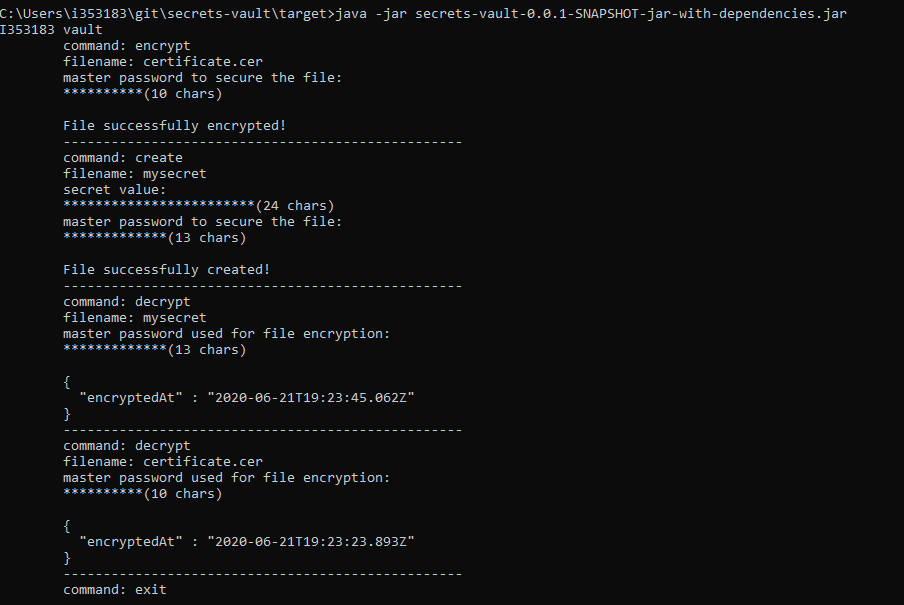

# secrets-vault

Secrets Vault enables you to store secrets/credentials securely on your file system. The secrets/credentials are encrypted with a key that is derived from a password provided by you (the user). Every secret is associated with its own password so you should provide the password that corresponds to the secret every time you read it (or choose a password every time you create a secret). The password should be between 6 nad 64 characters and should contain at least one symbol of each group: digits, capital letters and small letters. 

You can build the project using 'mvn clean install'. If you want scan for vulnarabilties to be performed just use the 'owasp-dependency-check' profile ('mvn clean install -Powasp-dependency-check').

### Creating a secret (file)

The flow in this scenario is as follows:

1. Specify 'create' command.
2. Type a filename. (could not be blank) - if there is already a file with the given name - fail
3. Type the secret you want to be protected.
4. Type the master password that is used for protection.
5. An AES data encryption key is generated using the PBKDF2 generation function with HMAC-SHA256.
6. The secret you provided in 4. is encrypted using AES encryption (with the generated in 5. key) in CBC mode.
7. A file with the specifed in 2. name is created and the encrypted value (alongside with the IV and the provided master password hash (SHA-256)) is written.

- Steps 1 to 4 should be made by the user

### Reading a secret

The flow in this scenario is as follows:

1. Specify 'read' command
2. Type a filename. (could not be blank) - if there is NO file with the given name - fail
3. Type the master password that is protecting this secret.
4. An AES decryption key is generated using the PBKDF2 generation function with HMAC-SHA256.
5. SHA-256 hash of the key from 4. is compared against the one that is saved in the corresponding file. If this check does NOT pass - fail. Otherwise:
6. Decrypt the secret using the key from 4. and print it in the console.

- Steps 1 to 3 should be made by the user

### Example

